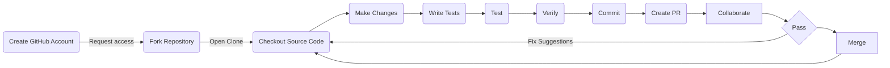

# Contributing

## Prerequisites

Prior to contributing to a Google Open Source repository, Google, LLC requires non-Google contributors to sign and file a [Contributor License Agreement](https://cla.developers.google.com/clas). If you DO NOT have a CLA on file your code WILL NOT be merged into this repository.

### Why do we have a CLA?

Our CLA allows open source projects administered by Google to safely accept code and documentation from external contributors.

For additional information, please visit our [Alphabet CLA Policy and Rationale](https://opensource.google/documentation/reference/cla/policy) page.

### Code Style Guides

- [HTML / CSS](https://google.github.io/styleguide/htmlcssguide.html)
- [Java Script](https://google.github.io/styleguide/jsguide.html)

### Code of Conduct

At Google, we recognize and celebrate the creativity and collaboration of open source contributors and the diversity of skills, experiences, cultures, and opinions they bring to the projects and communities they participate in.

Every one of Google's open source projects and communities are inclusive environments, based on treating all individuals respectfully, regardless of gender identity and expression, sexual orientation, disabilities, neurodiversity, physical appearance, body size, ethnicity, nationality, race, age, religion, or similar personal characteristic.

We value diverse opinions, but we value respectful behavior more.

Respectful behavior includes:

Being considerate, kind, constructive, and helpful.
Not engaging in demeaning, discriminatory, harassing, hateful, sexualized, or physically threatening behavior, speech, and imagery.
Not engaging in unwanted physical contact.
Some Google open source projects may adopt an explicit project code of conduct, which may have additional detailed expectations for participants. Most of those projects will use our modified Contributor Covenant.

Resolve peacefully
We do not believe that all conflict is necessarily bad; healthy debate and disagreement often yields positive results. However, it is never okay to be disrespectful.

If you see someone behaving disrespectfully, you are encouraged to address the behavior directly with those involved. Many issues can be resolved quickly and easily, and this gives people more control over the outcome of their dispute. If you are unable to resolve the matter for any reason, or if the behavior is threatening or harassing, report it. We are dedicated to providing an environment where participants feel welcome and safe.

Reporting problems
Some Google open source projects may adopt a project-specific code of conduct. In those cases, a Google employee will be identified as the Project Steward, who will receive and handle reports of code of conduct violations. In the event that a project hasn’t identified a Project Steward, you can report problems by emailing opensource@google.com.

We will investigate every complaint, but you may not receive a direct response. We will use our discretion in determining when and how to follow up on reported incidents, which may range from not taking action to permanent expulsion from the project and project-sponsored spaces. We will notify the accused of the report and provide them an opportunity to discuss it before any action is taken. The identity of the reporter will be omitted from the details of the report supplied to the accused. In potentially harmful situations, such as ongoing harassment or threats to anyone's safety, we may take action without notice.

This document was adapted from the IndieWeb Code of Conduct.

## Introduction

## Licensing

All contributors will contribute under the Apache 2.0 License and agree to the
terms of committing to open source repositories.
