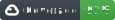
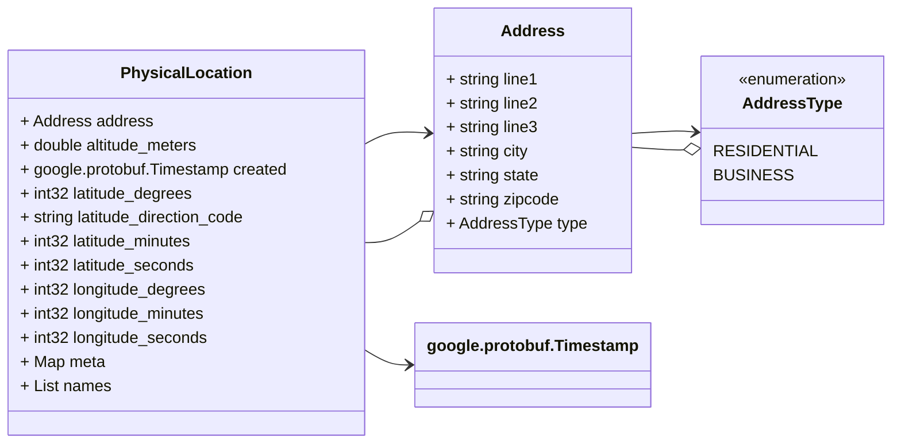

# Proto Diagram Tool




This utility package is a compiled Go program that reads a protobuf
source directory and generates Mermaid Diagrams in PROTO_DIAGRAM.md files
in each directory.

> NOTE: Only Proto 3 syntax is supported.

This utility was created to ease documentation generation of complex
Protobuf Libraries in order to simplify understanding the models and services
described in a Protobuf.

If you find this useful, awesome! If you find a bug, please contribute a patch,
or open a bug. Please follow the [Contributing](CONTRIBUTING.md) guidelines.

## Test Input and Output

#### Command 

```shell
./proto-diagram-tool -d test/protos
````

| Input File                                                          | Output File                                                            |
|---------------------------------------------------------------------|------------------------------------------------------------------------|
| [Location Protobuf](test/protos/test/location/model.proto)          | [Location Markdown](test/protos/test/location/model.proto.md)          |
| [Location Service Protobuf](test/protos/test/service/service.proto) | [Location Service Markdown](test/protos/test/service/service.proto.md) |


## Building
```shell
// Clone
git clone https://github.com/rrmcguinness/proto-diagram-tool

cd proto-diagram-tool

// Build
go build
```

## CI/CD Pipeline
The CI/CD Pipeline is run using Bazel and is responsible for building all
platform build types.

## Use and Options

```shell
./proto-digram -h

Usage of ./proto-diagram:
  -d string
        The directory to read. (default ".")
  -debug
        Enable debugging
  -r    Read recursively. (default true)
  
./proto-diagram -d test/protos
```

## Quick Example

### Protobuf Input

```protobuf
// A physical location that can be described with either an address
// or a set of geo coordinates.
message PhysicalLocation {
  // A postal address for the physical location.
  message Address {
    // Address type is used to identify the type of address.
    enum AddressType {
      RESIDENTIAL = 0; // A residential address
      BUSINESS = 1; // A business address
    }
    // First line of the address
    string line1 = 1;
    // Second line of the address
    string line2 = 2;
    // Third line of the address
    string line3 = 3;
    // The city or township
    string city = 4;
    // The state or province
    string state = 5;
    // The postal code
    string zipcode = 6;
    // The type of address
    AddressType type = 7;
    // Reserved for future use
    reserved 8 to 20;
  }
  // The timestamp the record was created
  google.protobuf.Timestamp created = 1;
  // The mailing address of the location
  Address address = 2;
  // Longitude degrees
  int32 longitude_degrees = 3 [json_name = 'lng_d'];
  // Longitude Minutes
  int32 longitude_minutes = 4 [json_name = 'lng_m'];
  // Longitude Seconds
  int32 longitude_seconds = 5 [json_name = 'lng_s'];
  // Longitude Degrees
  int32 latitude_degrees = 6  [json_name = 'lat_d'];
  // Latitude Minutes
  int32 latitude_minutes = 7  [json_name = 'lat_m'];
  // Latitude Seconds
  int32 latitude_seconds = 8  [json_name = 'lat_s'];
  // Latitude Direction Code
  string latitude_direction_code = 9  [json_name = 'lat_dir_code'];
  // Altitude in Meters
  double altitude_meters = 10  [json_name = 'alt_m'];
  // Additional Meta Data
  map<string, string> meta = 11;
  // Names for the location
  repeated string names = 12 [json_name = 'names'];
}
```

### Markdown Output
```markdown
## Message: PhysicalLocation
<div style="font-size: 12px; margin-top: -10px;" class="fqn">FQN: test.location.PhysicalLocation</div>

A physical location that can be described with either an address or a set of geo coordinates.

| Field                   | Ordinal | Type                      | Label    | Description                          |
|-------------------------|---------|---------------------------|----------|--------------------------------------|
| address                 | 2       | Address                   |          | The mailing address of the location  |
| altitude_meters         | 10      | double                    |          | Altitude in Meters                   |
| created                 | 1       | google.protobuf.Timestamp |          | The timestamp the record was created |
| latitude_degrees        | 6       | int32                     |          | Longitude Degrees                    |
| latitude_direction_code | 9       | string                    |          | Latitude Direction Code              |
| latitude_minutes        | 7       | int32                     |          | Latitude Minutes                     |
| latitude_seconds        | 8       | int32                     |          | Latitude Seconds                     |
| longitude_degrees       | 3       | int32                     |          | Longitude degrees                    |
| longitude_minutes       | 4       | int32                     |          | Longitude Minutes                    |
| longitude_seconds       | 5       | int32                     |          | Longitude Seconds                    |
| meta                    | 11      | string, string            | Map      | Additional Meta Data                 |
| names                   | 12      | string                    | Repeated | Names for the location               |

...
```

### Mermaid Diagram
