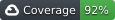
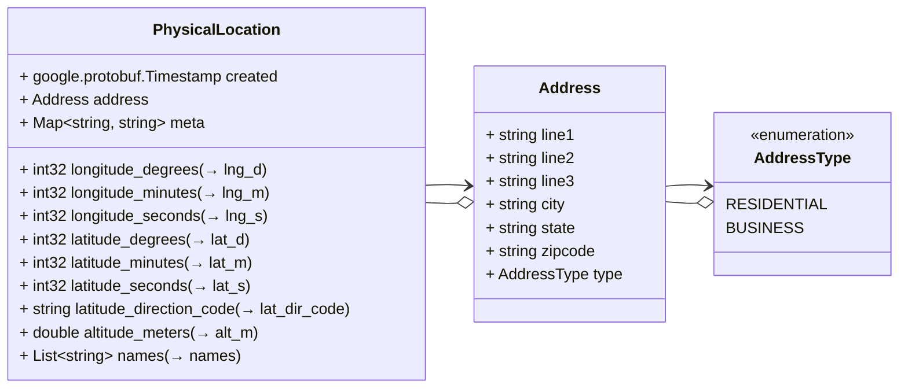

# Proto Gen MD Diagrams




This utility package is a compiled Go program that reads a protobuf
source directory and generates Mermaid Diagrams in <protobuf-file-name>.md files
in each directory, or the output directory with the given tree structure.

> NOTE: Only Proto 3 syntax is supported.

This utility was created to ease documentation generation of complex
Protobuf libraries to visualize models and services described in a Protocol buffers.

If you find this useful, awesome! If you find a bug, please contribute a patch,
or open a bug. Please follow the [Contributing](CONTRIBUTING.md) guidelines.

## Test Input and Output

### Build and test

#### Using Native Go

```shell
go build && go test ./...
./proto-gen-md-diagrams -d ./pkg/proto/data/test/
```

#### Using Bazel

Since Bazel is CI/CD workflow program it compiles for all targets.

```shell
bazel build //... && bazel test //...

# Linux 
bazel-bin/proto-gen-md-diagrams-linux-x86_64

# OS X X64
proto-gen-md-diagrams-osx-x86_64

# OS X Apple Silicon
bazel-bin/proto-gen-md-diagrams-osx-arm64

# Windows
bazel-bin/proto-gen-md-diagrams-win-x86_64
```

| Input File                                                             | Output File                                                               |
|------------------------------------------------------------------------|---------------------------------------------------------------------------|
| [Location Protobuf](pkg/proto/data/test/location/model.proto)          | [Location Markdown](pkg/proto/data/test/location/model.proto.md)          |
| [Location Service Protobuf](pkg/proto/data/test/service/service.proto) | [Location Service Markdown](pkg/proto/data/test/service/service.proto.md) |

## Building

### Go Lang

```shell
cd proto-gen-md-diagrams
// Build
go build && go test ./...
```

## Use and Options

```shell
./proto-gen-md-diagrams -h

Usage of ./proto-gen-md-diagrams:
  -d string
        The directoryFlag to read. (default ".")
  -debugFlag
        Enable debugging
  -o string
        Specifies the outputFlag directoryFlag, if not specified, the processor will write markdown in the proto directories. (default ".")
  -r    Read recursively. (default true)
  -v    Enable Visualization (default true)
  -w    Enable writing output (default true)
  -md   Enable pure MD output (default false)

  
./proto-gen-md-diagrams -d test/protos
```

## Quick Example

### Protobuf Input

```protobuf
// A physical location that can be described with either an address
// or a set of geo coordinates.
message PhysicalLocation {
  // A postal address for the physical location.
  message Address {
    // Address type is used to identify the type of address.
    enum AddressType {
      RESIDENTIAL = 0; // A residential address
      BUSINESS = 1; // A business address
    }
    // First line of the address
    string line1 = 1;
    // Second line of the address
    string line2 = 2;
    // Third line of the address
    string line3 = 3;
    // The city or township
    string city = 4;
    // The state or province
    string state = 5;
    // The postal code
    string zipcode = 6;
    // The type of address
    AddressType type = 7;
    // Reserved for future use
    reserved 8 to 20;
  }
  // The timestamp the record was created
  google.protobuf.Timestamp created = 1;
  // The mailing address of the location
  Address address = 2;
  // Longitude degrees
  int32 longitude_degrees = 3 [json_name = 'lng_d'];
  // Longitude Minutes
  int32 longitude_minutes = 4 [json_name = 'lng_m'];
  // Longitude Seconds
  int32 longitude_seconds = 5 [json_name = 'lng_s'];
  // Longitude Degrees
  int32 latitude_degrees = 6  [json_name = 'lat_d'];
  // Latitude Minutes
  int32 latitude_minutes = 7  [json_name = 'lat_m'];
  // Latitude Seconds
  int32 latitude_seconds = 8  [json_name = 'lat_s'];
  // Latitude Direction Code
  string latitude_direction_code = 9  [json_name = 'lat_dir_code'];
  // Altitude in Meters
  double altitude_meters = 10  [json_name = 'alt_m'];
  // Additional Meta Data
  map<string, string> meta = 11;
  // Names for the location
  repeated string names = 12 [json_name = 'names'];
}
```

## Supported Output Formats

`proto-gen-md-diagrams` supports two markdown output formats, both of which include Mermaid class diagrams when visualization is enabled (`-v=true`, default):

1. **Default Mode (HTML-Enhanced Markdown)**: Uses styled HTML elements (`<div class="fqn">`, `<div class="comment">`) for metadata styling and clean table displays.
2. **Pure Markdown Mode (`-md`)**: Produces strict GitHub-Flavored Markdown using backtick code formatting (`` `field` ``) and bold text without HTML tags.

### Output Mermaid Diagram

The generator emits a Mermaid class diagram visualizing message types, nested messages, enums, relationships, field types, and optional custom JSON field aliases (`json_name`):


```mermaid
classDiagram
direction LR

%% A physical location that can be described with either an address or a set of geo coordinates.

class PhysicalLocation {
  + google.protobuf.Timestamp created
  + Address address
  + int32 longitude_degrees (→ lng_d)
  + int32 longitude_minutes (→ lng_m)
  + int32 longitude_seconds (→ lng_s)
  + int32 latitude_degrees (→ lat_d)
  + int32 latitude_minutes (→ lat_m)
  + int32 latitude_seconds (→ lat_s)
  + string latitude_direction_code (→ lat_dir_code)
  + double altitude_meters (→ alt_m)
  + Map~string,  string~ meta
  + List~string~ names (→ names)
}
PhysicalLocation --> `Address`
PhysicalLocation --o `Address`

%% A postal address for the physical location.

class Address {
  + string line1
  + string line2
  + string line3
  + string city
  + string state
  + string zipcode
  + AddressType type
}
Address --> `AddressType`
Address --o `AddressType`
%% Address type is used to identify the type of address.

class AddressType{
  <<enumeration>>
  RESIDENTIAL
  BUSINESS
}
```

### Format Examples

#### 1. Default Mode Output (HTML-Enhanced)

<div style="font-size: 12px; margin-top: -10px;" class="fqn">FQN: test.location.PhysicalLocation</div>

<div class="comment"><span>A physical location that can be described with either an address or a set of geo coordinates.</span><br/></div>

| Field                   | Ordinal | Type                      | Label                 | Description                           |
|-------------------------|---------|---------------------------|-----------------------|---------------------------------------|
| created                 | 1       | google.protobuf.Timestamp |                       | The timestamp the record was created  |
| address                 | 2       | Address                   |                       | The mailing address of the location   |
| longitude_degrees       | 3       | int32                     | JSON: lng_d           | Longitude degrees                     |
| longitude_minutes       | 4       | int32                     | JSON: lng_m           | Longitude Minutes                     |
| longitude_seconds       | 5       | int32                     | JSON: lng_s           | Longitude Seconds                     |
| latitude_degrees        | 6       | int32                     | JSON: lat_d           | Longitude Degrees                     |
| latitude_minutes        | 7       | int32                     | JSON: lat_m           | Latitude Minutes                      |
| latitude_seconds        | 8       | int32                     | JSON: lat_s           | Latitude Seconds                      |
| latitude_direction_code | 9       | string                    | JSON: lat_dir_code    | Latitude Direction Code               |
| altitude_meters         | 10      | double                    | JSON: alt_m           | Altitude in Meters                    |
| meta                    | 11      | string, string            | Map                   | Additional Meta Data                  |
| names                   | 12      | string                    | Repeated, JSON: names | Names for the location                |

#### 2. Pure Markdown Mode Output (`-md`)

**FQN**: test.location.PhysicalLocation

A physical location that can be described with either an address or a set of geo coordinates.

| Field                     | Ordinal | Type                        | Label                 | Description                           |
|---------------------------|---------|-----------------------------|-----------------------|---------------------------------------|
| `created`                 | 1       | `google.protobuf.Timestamp` |                       | The timestamp the record was created  |
| `address`                 | 2       | `Address`                   |                       | The mailing address of the location   |
| `longitude_degrees`       | 3       | `int32`                     | JSON: lng_d           | Longitude degrees                     |
| `longitude_minutes`       | 4       | `int32`                     | JSON: lng_m           | Longitude Minutes                     |
| `longitude_seconds`       | 5       | `int32`                     | JSON: lng_s           | Longitude Seconds                     |
| `latitude_degrees`        | 6       | `int32`                     | JSON: lat_d           | Longitude Degrees                     |
| `latitude_minutes`        | 7       | `int32`                     | JSON: lat_m           | Latitude Minutes                      |
| `latitude_seconds`        | 8       | `int32`                     | JSON: lat_s           | Latitude Seconds                      |
| `latitude_direction_code` | 9       | `string`                    | JSON: lat_dir_code    | Latitude Direction Code               |
| `altitude_meters`         | 10      | `double`                    | JSON: alt_m           | Altitude in Meters                    |
| `meta`                    | 11      | `string, string`            | Map                   | Additional Meta Data                  |
| `names`                   | 12      | `string`                    | Repeated, JSON: names | Names for the location                |

