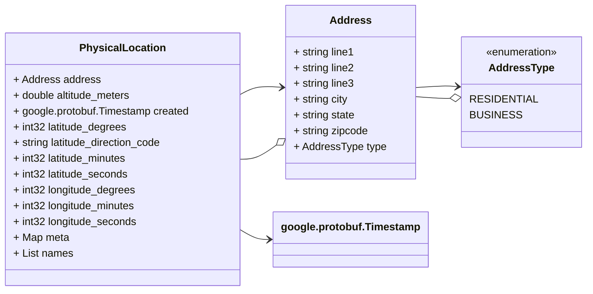

# Package: test.location

Copyright 2022 Google LLC Licensed under the Apache License, Version 2.0 (the "License"); you may not use this file except in compliance with the License. You may obtain a copy of the License at http://www.apache.org/licenses/LICENSE-2.0 Unless required by applicable law or agreed to in writing, software distributed under the License is distributed on an "AS IS" BASIS, WITHOUT WARRANTIES OR CONDITIONS OF ANY KIND, either express or implied. See the License for the specific language governing permissions and limitations under the License.

## Table Of Content
* [Imports](#imports)
* [Options](#options)
* Messages
  * [Physical Location](#physicallocation)
  * [Address](#address)
* Enums
  * [Address Type](#addresstype)

## Imports 

| Import                          | Description                         |
|---------------------------------|-------------------------------------|
| google/protobuf/timestamp.proto | Import google timestamp to identify |

## Options

| Name                | Value                                         | Description     |
|---------------------|-----------------------------------------------|-----------------|
| go_package          | "github.com/rrmcguinness/proto/test/location" | Go Lang Options |
| java_package        | "com.github.rrmcguinness.proto.test.location" | Java Options    |
| java_multiple_files | true                                          |                 |

## Model

## PhysicalLocation 

FQN: test.location.PhysicalLocation

A physical location that can be described with either an address or a set of geo coordinates.

| Field                   | Ordinal | Type                      | Label    | Description                          |
|-------------------------|---------|---------------------------|----------|--------------------------------------|
| address                 | 2       | Address                   |          | The mailing address of the location  |
| altitude_meters         | 10      | double                    |          | Altitude in Meters                   |
| created                 | 1       | google.protobuf.Timestamp |          | The timestamp the record was created |
| latitude_degrees        | 6       | int32                     |          | Longitude Degrees                    |
| latitude_direction_code | 9       | string                    |          | Latitude Direction Code              |
| latitude_minutes        | 7       | int32                     |          | Latitude Minutes                     |
| latitude_seconds        | 8       | int32                     |          | Latitude Seconds                     |
| longitude_degrees       | 3       | int32                     |          | Longitude degrees                    |
| longitude_minutes       | 4       | int32                     |          | Longitude Minutes                    |
| longitude_seconds       | 5       | int32                     |          | Longitude Seconds                    |
| meta                    | 11      | string, string            | Map      | Additional Meta Data                 |
| names                   | 12      | string                    | Repeated | Names for the location               |

## Address

FQN: test.location.PhysicalLocation.Address

A postal address for the physical location.

| Field   | Ordinal | Type        | Label | Description                |
|---------|---------|-------------|-------|----------------------------|
| city    | 4       | string      |       | The city or township       |
| line1   | 1       | string      |       | First line of the address  |
| line2   | 2       | string      |       | Second line of the address |
| line3   | 3       | string      |       | Third line of the address  |
| state   | 5       | string      |       | The state or province      |
| type    | 7       | AddressType |       | The type of address        |
| zipcode | 6       | string      |       | The postal code            |

## AddressType

FQN: test.location.PhysicalLocation.Address.AddressType

Address type is used to identify the type of address.

| Name        | Ordinal | Description           |
|-------------|---------|-----------------------|
| RESIDENTIAL | 0       | A residential address |
| BUSINESS    | 1       | A business address    |

<!-- Created by: Proto Diagram Tool -->
<!-- https://github.com/rrmcguinness/proto-diagram-tool -->

