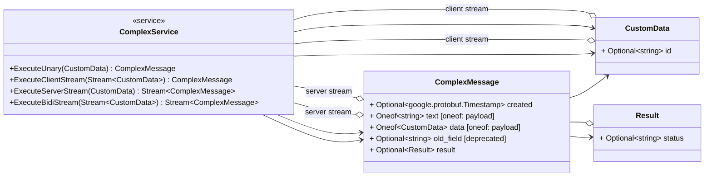
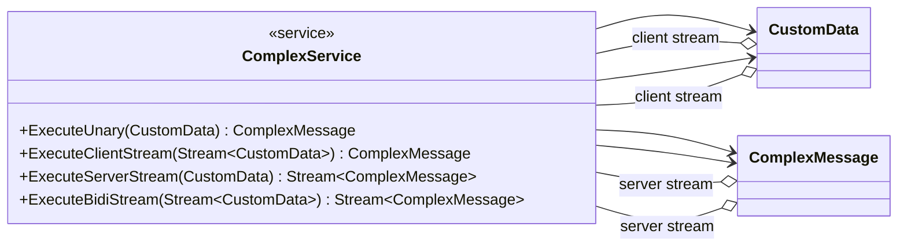
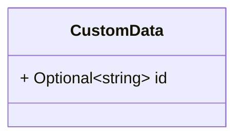
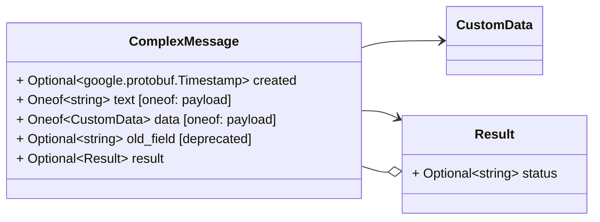
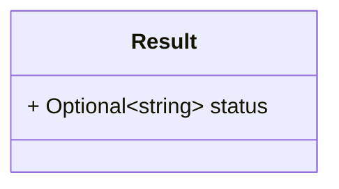

# Package: test.complex

 

## Imports

| Import                          | Description |
|---------------------------------|-------------|
| google/protobuf/timestamp.proto |             |

## Options

| Name         | Value            | Description |
|--------------|------------------|-------------|
| java_package | com.test.complex |             |

### test.complex Diagram

## Service: ComplexService

FQN: test.complex

 

### ComplexService Diagram

| Method               | Parameter (In)       | Parameter (Out)          | Description |
|----------------------|----------------------|--------------------------|-------------|
| ExecuteUnary         | CustomData           | ComplexMessage           |             |
| ExecuteClientStream  | Stream\<CustomData\> | ComplexMessage           |             |
| ExecuteServerStream  | CustomData           | Stream\<ComplexMessage\> |             |
| ExecuteBidiStream    | Stream\<CustomData\> | Stream\<ComplexMessage\> |             |

### CustomData Diagram

### ComplexMessage Diagram

## Message: CustomData

FQN: test.complex.CustomData

 

| Field | Ordinal | Type   | Label    | Description |
|-------|---------|--------|----------|-------------|
| id    | 1       | string | Optional |             |

## Message: ComplexMessage

FQN: test.complex.ComplexMessage

 

| Field     | Ordinal | Type                      | Label                | Description |
|-----------|---------|---------------------------|----------------------|-------------|
| created   | 1       | google.protobuf.Timestamp | Optional             |             |
| text      | 2       | string                    | Oneof (payload)      |             |
| data      | 3       | CustomData                | Oneof (payload)      |             |
| old_field | 4       | string                    | Optional, Deprecated |             |
| result    | 5       | Result                    | Optional             |             |

### Result Diagram

## Message: Result

FQN: test.complex.ComplexMessage.Result

 

| Field  | Ordinal | Type   | Label    | Description |
|--------|---------|--------|----------|-------------|
| status | 1       | string | Optional |             |

<!-- Created by: Proto Diagram Tool -->
<!-- https://github.com/GoogleCloudPlatform/proto-gen-md-diagrams -->
