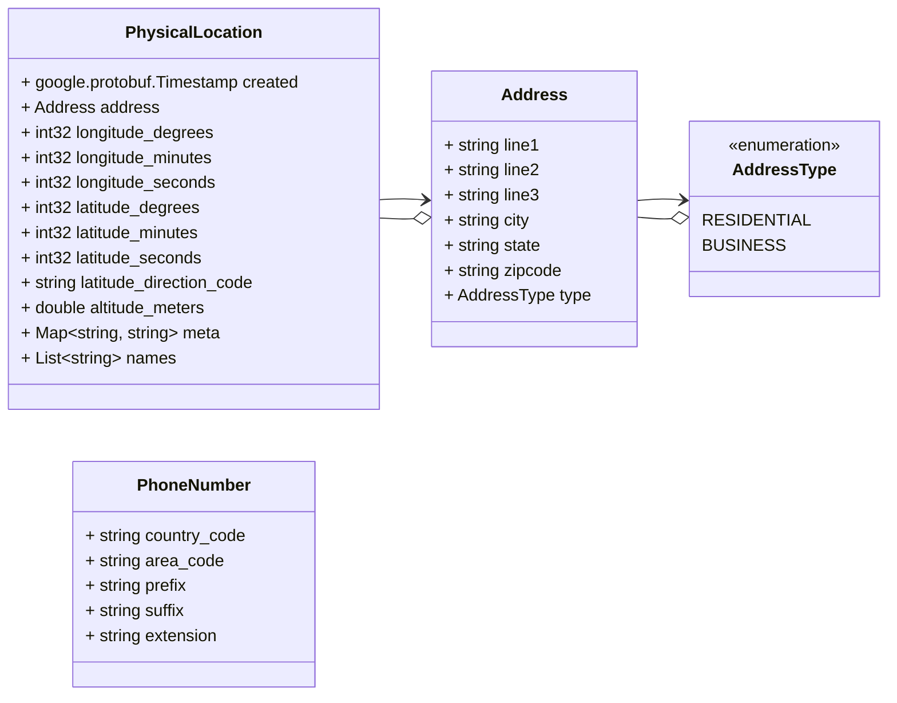
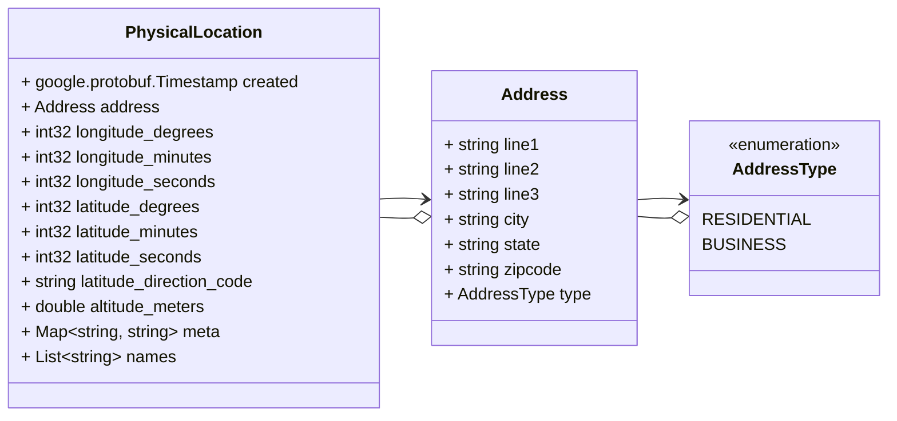
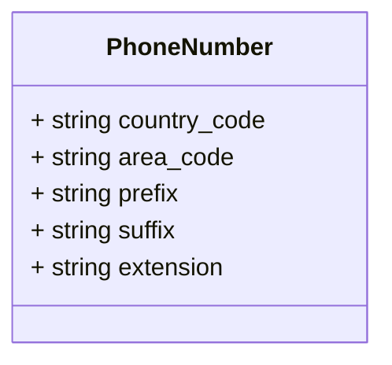
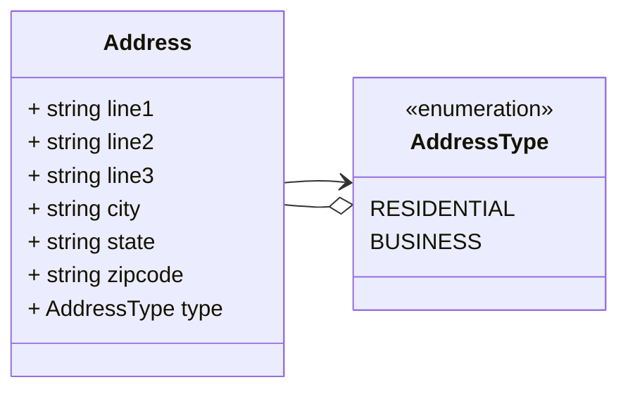
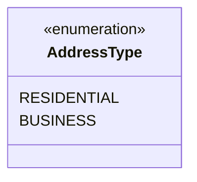

# Package: test.location

 Copyright 2022 Google LLC Licensed under the Apache License, Version 2.0 (the "License"); you may not use this file except in compliance with the License. You may obtain a copy of the License at  http://www.apache.org/licenses/LICENSE-2.0 Unless required by applicable law or agreed to in writing, software distributed under the License is distributed on an "AS IS" BASIS, WITHOUT WARRANTIES OR CONDITIONS OF ANY KIND, either express or implied. See the License for the specific language governing permissions and limitations under the License.  

## Imports

| Import                          | Description                          |
|---------------------------------|--------------------------------------|
| google/protobuf/timestamp.proto | Import google timestamp to identify  |

## Options

| Name                | Value                   | Description      |
|---------------------|-------------------------|------------------|
| go_package          | gcp/proto/test/location | Go Lang Options  |
| java_package        | gcp.proto.test.location | Java Options     |
| java_multiple_files | true                    |                  |

### test.location Diagram

### PhysicalLocation Diagram

### PhoneNumber Diagram

## Message: PhysicalLocation

FQN: test.location.PhysicalLocation

A physical location that can be described with either an address or a set of geo coordinates. 

| Field                   | Ordinal | Type                      | Label    | Description                           |
|-------------------------|---------|---------------------------|----------|---------------------------------------|
| created                 | 1       | google.protobuf.Timestamp |          | The timestamp the record was created  |
| address                 | 2       | Address                   |          | The mailing address of the location   |
| longitude_degrees       | 3       | int32                     |          | Longitude degrees                     |
| longitude_minutes       | 4       | int32                     |          | Longitude Minutes                     |
| longitude_seconds       | 5       | int32                     |          | Longitude Seconds                     |
| latitude_degrees        | 6       | int32                     |          | Longitude Degrees                     |
| latitude_minutes        | 7       | int32                     |          | Latitude Minutes                      |
| latitude_seconds        | 8       | int32                     |          | Latitude Seconds                      |
| latitude_direction_code | 9       | string                    |          | Latitude Direction Code               |
| altitude_meters         | 10      | double                    |          | Altitude in Meters                    |
| meta                    | 11      | string, string            | Map      | Additional Meta Data                  |
| names                   | 12      | string                    | Repeated | Names for the location                |

### Address Diagram

### AddressType Diagram

## Message: Address

FQN: test.location.PhysicalLocation.Address

A postal address for the physical location. 

| Field   | Ordinal | Type        | Label | Description                 |
|---------|---------|-------------|-------|-----------------------------|
| line1   | 1       | string      |       | First line of the address   |
| line2   | 2       | string      |       | Second line of the address  |
| line3   | 3       | string      |       | Third line of the address   |
| city    | 4       | string      |       | The city or township        |
| state   | 5       | string      |       | The state or province       |
| zipcode | 6       | string      |       | The postal code             |
| type    | 7       | AddressType |       | The type of address         |

## Enum: AddressType

FQN: test.location.PhysicalLocation.Address.AddressType

Address type is used to identify the type of address. 

| Name        | Ordinal | Description            |
|-------------|---------|------------------------|
| RESIDENTIAL | 0       | A residential address  |
| BUSINESS    | 1       | A business address     |

## Message: PhoneNumber

FQN: test.location.PhoneNumber

 

| Field        | Ordinal | Type   | Label | Description |
|--------------|---------|--------|-------|-------------|
| country_code | 1       | string |       |             |
| area_code    | 2       | string |       |             |
| prefix       | 3       | string |       |             |
| suffix       | 4       | string |       |             |
| extension    | 5       | string |       |             |

<!-- Created by: Proto Diagram Tool -->
<!-- https://github.com/GoogleCloudPlatform/proto-gen-md-diagrams -->
